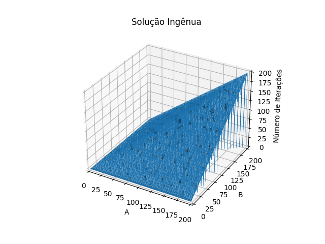
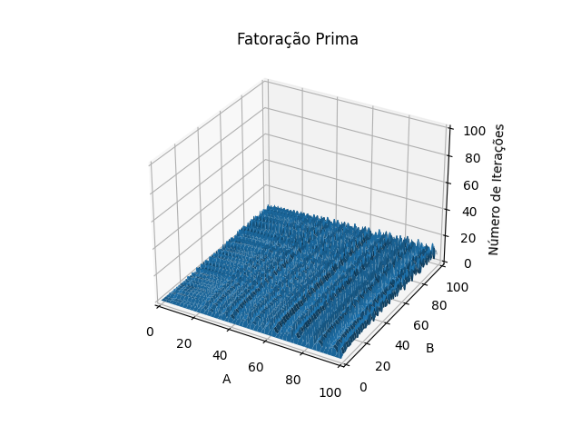
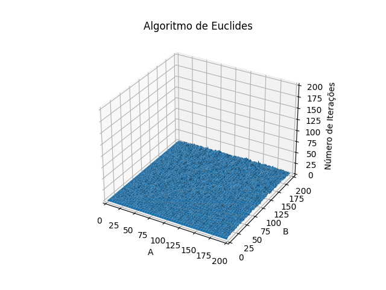

# Algoritmo de Euclides

<br>

Davi Rodriguez Golebiovski

Aritmética Modular - Itinerário de Matemática
Nota 3 - 2º Trimestre

Agosto 2023

---

## Índice
 - Motivação
 - Máximo Divisor Comum
 - Solução Ingênua
 - Fatoração Prima
 - Algoritmo de Euclides
 - Múltiplos Inteiros
 - Dificuldades

---

## Motivação

O **Algoritmo de Euclides** apresenta uma elegante técnica para encontrar o **máximo divisor comum** entre dois ou mais inteiros.

Nessa apresentação, espero ressaltar a eficiência computacional desse algoritmo quando comparado com outras implementações frequentemente utilizadas.

---

## Máximo Divisor Comum

O **máximo divisor comum** (MDC) de dois ou mais inteiros, não todos nulos, é o maior inteiro positivo que divide tais números simultaneamente. Esse é denotado por $\text{mdc}(a, b)$.

$$\text{mdc}(9, 12) = 3$$
$$\text{mdc}(-2, 10) = 2$$
$$\text{mdc}(0, 24) = 24$$

---

## Solução Ingênua

Para encontrar o $\text{mdc}(a, b)$, a solução ingênua consistiria em iterar sobre todos os inteiros de $\min(a, b)$ a $1$ até que um deles divida ambos $a$ e $b$.

Essa solução apresenta a complexidade de $\text{O}(\min(a, b))$.

---

```python
# Máximo Divisor Comum - Solução Ingênua

def mdc(a, b):
    a = abs(a)
    b = abs(b)
    
    if (a == 0): return b
    if (b == 0): return a
    
    for i in range(min(a, b), 0, -1):
        if ((a % i) == 0 and (b % i) == 0):
            return i
```

---

## Fatoração Prima

Outra forma de encontrar o $\text{mdc}(a, b)$ consiste em decompor ambos os inteiros em fatores primos. Logo, o máximo divisor comum é o produto dos fatores comuns entre ambos:

$$84 = \underline{2}^2\times \underline{3}\times \underline{7}$$
$$2100 = \underline{2}^2\times \underline{3}\times 5^2\times \underline{7}$$

$$\text{mdc}(2100, 84) = \underline{2}^2\times \underline{3}\times \underline{7} = 84$$

---

### Encontrando fatores primos

Para decompor um inteiro $n$ em fatores primos, podemos percorrer todos os inteiros de $2$ a $n$. Para cada um desses inteiros, enquanto $n$ for divisível por esse, dividiremos $n$ pelo inteiro e o adicionaremos à lista de fatores.

Essa solução possui complexidade $\text{O}(n)$.

---

```python
# Fatoração Prima - Solução Ingênua

def Fatorar(n):
    fatores = []
    
    for d in range(2, n+1):
        while ((n % d) == 0):
            fatores.append(d)
            n /= d
    return fatores
```

---

### Divisão por tentativa

O método de **divisão por tentativa** apresenta uma forma mais eficiente de computar os fatores primos de um inteiro $n$. Nele, iteramos somente de $2$ a $\lfloor \sqrt n \rfloor$, executando o mesmo processo em cada iteração.

Após a execução, ficamos com um novo inteiro $n$. Porém, se $n \neq 1$, podemos afirmar que esse trata-se de um primo e fator do $n$ original.

Essa solução possui complexidade $\text{O}(\sqrt n)$.

---

```python
# Fatoração Prima - Divisão por Tentativa

def Fatorar(n):
    fatores = []
    
    d = 2
    
    while (d*d <= n):
        while ((n % d) == 0):
            fatores.append(d)
            n /= d
        d += 1
    
    if (n != 1): fatores.append(int(n))
    return fatores
```

---

#### Demonstração

**Hipótese**: Seja $n$ um inteiro positivo, existe pelo menos um fator de $n$ menor que ou igual a $\sqrt{n}$.

Suponhamos, por absurdo, que $n = ab$ e ambos $a$ e $b$ são maiores que $\sqrt n$:

$$a > \sqrt{n}, \ b > \sqrt{n}$$
$$ab > \sqrt{n}\sqrt{n} = n$$
$$n > n \text{ (Absurdo)}$$

---

```python
# Máximo Divisor Comum - Fatoração Prima
def mdc(a, b):
    a = abs(a)
    b = abs(b)
    
    if (a == 0): return b
    if (b == 0): return a
    
    A = Fatorar(a)
    B = Fatorar(b)
    res = 1
    
    for d in set(A):
        res *= d**min(A.count(d), B.count(d))
    return res
```

---

## Algoritmo de Euclides

O **Algoritmo de Euclides** demonstra que:

$$\text{mdc}(a, b) = \text{mdc}(b, a-b)$$

Dessa forma, podemos reduzir qualquer MDC recursivamente:

$$\text{mdc}(21, 14) = \text{mdc}(14, 7) = \text{mdc}(7, 7) = \text{mdc}(7, 0) = 7$$

---

### Módulo

Como esse processo consiste em subtrair $b$ de $a$ p máximo de vezes possível sem que $a < 0$, podemos descrevê-lo como:

$$\text{mdc}(a, b) = \text{mdc}(b, a \text{ mod } b)$$

Por exemplo,

$$\text{mdc}(825, 400) = \text{mdc}(400, 25) = \text{mdc}(25, 0) = 25$$

---

### Demonstração

Seja $d$ um divisor comum de $a$ e $b$, temos que:

$$a = d\cdot k_1$$
$$b = d\cdot k_2$$

Subtraindo $b$ de $a$, vemos que:

$$a - b = d\cdot k_1 - d\cdot k_2$$
$$a - b = d(k_1 - k_2)$$

---

### Demonstração

Como $a - b = d(k_1 - k_2)$, podemos concluir que:

$$d | a \land d | b \ \ \Rightarrow \ \ d | b \land d | (a - b)$$

Seja $d = \text{mdc(a, b)}$, temos que $d|a$ e $d|b$. Logo, $d|(a - b)$:

$$\text{mdc}(a, b) = \text{mdc}(b, a-b)$$

---


### Implementação

O Algoritmo de Euclides segue as seguintes etapas:

 1. Se $a = 0$, então $\text{mdc}(a, b) = b$. Podemos retornar;
 2. Se $b = 0$, então $\text{mdc}(a, b) = a$. Podemos retornar;
 3. Retornamos $\text{mdc}(b, a \text{ mod } b)$, voltando à Etapa 1.

---

```python
# Máximo Divisor Comum - Algoritmo de Euclides
# Não Recursivo

def mdc(a, b):
    a = abs(a)
    b = abs(b)
    
    while (a and b):
        temp = b
        b = a % b
        a = temp
    
    return max(a, b)
```

---

```python
# Máximo Divisor Comum - Algoritmo de Euclides
# Recursivo

def mdc(a, b):
    a = abs(a)
    b = abs(b)
    
    if (a == 0): return b
    if (b == 0): return a
    
    return mdc(b, a % b)
```

---

### Complexidade

Diferente da solução ingênua, que possuía complexidade $\text{O}(\min(a, b))$, o Algoritmo de Euclides apresenta complexidade $\text{O}(\log \min(a, b))$.

---

<div style="margin: -100px -80px -80px -80px">
<div style="display: flex; justify-content: center; align-items: center; height: 100%;">
    
    
</div>
<div style="display: flex; justify-content: center; align-items: center; height: 100%;">
    
</div>
</div>

---

### Múltiplos Inteiros

Podemos estender o **Algoritmo de Euclides** para três ou mais inteiros. Para isso, note que:

$$\text{mdc}(a, b, c) = \text{mdc}(a, \text{mdc}(b, c))$$

---

```python
# Algoritmo de Euclides - Múltiplos Inteiros

from AlgoritmoDeEuclides import mdc

def mdcEstendido(*inteiros):
    res = inteiros[0]
    for i in inteiros[1:]:
        res = mdc(res, i)
    
    return res
```

---

## Bibliografia

 - [Greatest Common Divisor](https://en.wikipedia.org/wiki/Greatest_common_divisor). Wikipedia. Acesso em: 15/07/2023.
 - [How to Find the GCD of 0 and 24](https://youtu.be/KRsvJQPYtZ8). The Math Sorcerer, 2020. Acesso em: 15/07/2023.
 - [The Euclidean Algorithm](https://www.khanacademy.org/computing/computer-science/cryptography/modarithmetic/a/the-euclidean-algorithm). Khan Academy. Acesso em: 15/07/2023.

---

## Bibliografia

 - VANDERPLAS, Jake. [Three-Dimensional Plotting in Matplotlib](https://jakevdp.github.io/PythonDataScienceHandbook/04.12-three-dimensional-plotting.html). Python Data Science Handbook. Acesso em: 15/07/2023.
 - KOGLER et al. [Integer Factorization](https://cp-algorithms.com/algebra/factorization.html). Competitive Programming Algoritmos. Acesso em: 12/08/2023.

---

<div class="centered"><h1>Obrigado.</h1></div>